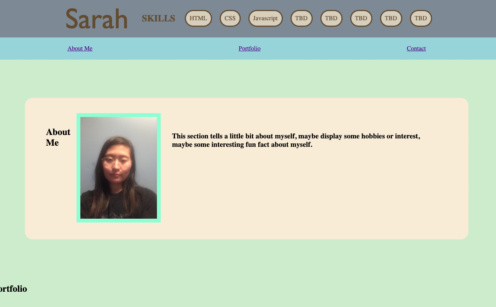

# homework-02-portfolio

Advanced CSS Challenge: Professional Portfolio

GitHub: https://github.com/minutemin/SarahM-portfolio

GitPages:   https://minutemin.github.io/SarahM-portfolio/

## Description ##

Advanced CSS Challenge: Professional Portfolio

This assignment we had to create our own code from scratch. Our goal was to create a webpage for our portfolio the help us successfully find jobs.  It needs to have certain categories, such as an about me section, a display of our projects/codes, a picture of us and contact information.  Links should direct you to the related section, the first project in our portfolio should be displayed larger than the other works and should take you to the deployed application, and the screen should adjust accordingly on different viewport sizes.  We also get to use the new skills we learned such as such as flexbox, media queries, css variables. 

WHAT I DID:

First I started off with a basic HTML structure that included all the things i needed.  Then I worked on the CSS sheet, adding styles to make my portfolio somewhat decent. I thought I should focus on the requirements and just keep things super simple, basic and unaestheically pleasing for now, and then work on it more as I have more projects under my belt. 

## Usage

To use this website, there are navigation bar at the top, which will direct you to the section below that refers to it.  There are also links to my deployed application and an image of the project (some images are placeholders). The links for my contacts takes you directly to my page or contact information (using generic websites for now).  When the screen goes smaller than 992 width, the header and name will change color and size.  When it goes to 768px, the navigation links will align in a column and the background color should change, along with the profile name font-size smaller.    When it reaches 576px for smartphones, then the main background color will change.  

## License

Licensed under the MIT license.
